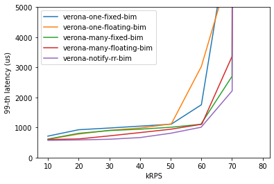
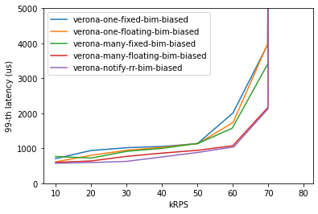

# Proposal for the Verona IO Subsystem

The goal of this design doc is to describe the proposal for supporting IO in the Verora runtime. The IO might depend on OS socket support or direct device access. The proposed design remains agnostic to the implementation.

## Terminology

- **token cown**: There is a utility cown in the queue of every scheduler thread. This cown helps with fairness guarantees (scheduler threads steal cowns from remote queues when hitting the token cown) and guarantees that there's always at least one element in the queue of the scheduler thread (which is an implementation requirement). (Existing functionality)
- **poller owner cown**: Every scheduler thread is also associated with a poller owner cown. This cown is in charge of a set of application poller cowns. The poller owner cown can receive messages to add and remove poller cowns. The poller owner cown implements its `notify` method. Whenever the poller owner cown is notified, it in turn notifies all its poller cowns.
- **poller cown**: Applications can define and register poller cowns. Poller cowns also implement their `notify` method and when notified they poll a specific resource and the schedule the equivalent cowns if there is work to be done. For example, a poller cown can be in charge of a `epoll` fd or a DPDK RX queue.

## Rational
The Verona subsystem need to periodically check for incoming IO events based on the current load. The frequency at which a scheduler thread processes a long running cown is a good indiciator of that. Under low load the cown is processed more often compared to high load cases that the execution of other cowns delay the execution of the long running cown. We take advantage of this inherent characteristic of the Verona runtime to poll for IO according to the current load by pacing the execution of the poller cowns based on how often a scheduler thread hits the token cown.

Specifically, each scheduler thread is associated with one token cown and one poller owner cown. Whenever the scheduler thread hits a token cown (either its local one or a stolen), it notifies a poller owner cown. The decision which poller owner cown to notify happens in a per scheduler thread round-robin manner. This way all poller owner cowns and consequently all poller cowns run at about the same frequency given the existing work stealing mechanism.

## Experimentation

Before concluding to the above proposal we considered the following cases.

- **floating poller owner cown**: This implementation does not depend on the `notify` mechanism. The poller owner cown is always scheduled on a scheduler thread queue and after executing it schedules itself again. The poller owner cowns, despite starting with 1-1 mapping to scheduler threads, they can be stolen by other scheduler threads.
- **fixed poller owner cown**: This implementation does not depend on the `notify` mechanism either. The poller owner cown runs and notifies the poller cown whenever the scheduler thread replenishses the consumed token cown. This way the poller owner cowns cannot be stolen.

Below we plot two latency (99th percentile) vs throughput curves for a synthetic service time server. The server busy loops for a configurable amount of time that is in the request. In this case, 90% of the requests spin for 55 us and 10% of the requests spin for 505 us for an average service time of 100us. The experiment runs on a 8-core machine, thus the max expected throughput is 80kRPS. We consider two cases with biased and unbiased connections. In the unbiased case connections are chosen in a uniformly random manner, while in the biased case there are some connections that are slightly more popular than others. Requests arrive at the server in an open loop manner with a Poisson inter-arrival distribution.

First, we observe that we need multiple poller owner cowns. Second, we observe that the fixed design behaves better than the floating one in the unbiased case and vice versa in the biased one. Unlike that, the proposed `notify-rr` design is the best peforming in terms of tail latency for both cases.