# Pyrona - Fearless Concurrency for Python

As part of Project Verona, we have been developing a new ownership model for Python, called Lungfish.
This model is designed to provide a safe and efficient way to manage memory and concurrency in Python programs.
Pyrona is our experiment to develop this approach.

## Plan for Python

### Quick prototyping in FrankenScript

Modifying a production language is a complex task.
As an initial step, we have been developing a toy language called [FrankenScript](https://github.com/fxpl/frankenscript) that allows us to quickly prototype our ideas for region-based ownership.
FrankenScript is a small language that is designed to be easy to modify and extend.
It is based on the ideas of ownership and concurrency that we are exploring in Project Verona, but where all the checks are dynamic.

This prototype has given us confidence in the conceptual ideas behind our ownership model, and has allowed us to explore the design space of ownership in a dynamic language.
It has also helped us explain our ideas and the different design decisions to people outside the Project Verona team.

FrankenScript generates a series of mermaid diagrams that show the region structure of the program.  An example of this is shown below:

### Engaging with the Python community

Over the last two years, we have been engaging with the Faster CPython team at Microsoft as a sounding board for our ideas.
In May 2025, we will be taking our first steps into the boarder Python community at the [Python Language Summit](https://us.pycon.org/2025/events/language-summit/).
We will be presenting our ideas and seeking feedback from the core developers of the language.

### Steps to a new ownership model

Building an ownership model for Python is a complex task, and we are taking a step-by-step approach to ensure that we get it right.

The first step is actually to build a concept of deep immutability into Python.  This can be split into three parts:

* Deep Immutability: We are starting with a deep immutability model, we have been drafting a [PEP](https://github.com/TobiasWrigstad/peps/pull/8) to describe this model.
  The current prototype is in a PR to a fork of CPython: https://github.com/mjp41/cpython/pull/51

* Manage cyclic immutable garbage with reference counting and 
  atomic reference counting of immutable objects. This will enable objects to be moved between sub-interpreters as they will no longer be managed by the interpreter local cycle collector.
  The current prototype is on the following branch: https://github.com/mjp41/cpython/tree/scc, which is based on top of the PR 51 mentioned above.

* Integration with message passing between sub-interpreters ([PEP734](https://peps.python.org/pep-0734/)).  This will enable us to get parallel performance even though we are technically not losing the GIL.

Deep Immutability is a key part of any ownership model as we need concurrent threads to be able to share type information without risking it being mutated under foot.
As types in Python are mutable objects, we need a way to share these objects between threads.

Once the immutability model is in place, then we can start applying the region-based ownership model to Python to permit safe sharing and transfer of mutable state.
This involves applying the ideas developed in the FrankenScript prototype to Python.
We have made progress on this in our prototyping ideas on CPython, but nothing is ready to try yet.

## FAQ

### What is Pyrona?

It is our approach to bringing region based ownership to Python.

### Why Python?

Python is the most popular programming language in the world.
With [PEP703](https://peps.python.org/pep-0703/), aka NoGil or "Free-Threaded" Python, Python is moving to a fully concurrent model.
This means a vast quantity of programmers will be potentially exposed to concurrency issues.
Bringing an ownership model to Python will help to make it easier to write concurrent programs, and to avoid the pitfalls of concurrency.

This is a perfect opportunity to influence the future of Python, and to help make programming experience better for everyone.

### Why not threads and locks?

We are initially exploring using message passing between sub-interpreters.  However, we could also apply the region ideas to locks, and provide a lock that gives temporary access to a region of memory associated with that lock.

We have sketched out a design for how to integrate with the full PEP 703 work, but have not attempted to implement that yet.

### Why not simply use Rust's ownership model?

Rust's ownership model is designed for a statically typed language, and restricts the type of object graphs that can be used in the language.
There is so much existing code in Python that the restrictions of Rust's ownership model would be too limiting.
We are designing a new ownership model based on regions that is designed to work with Python's dynamic typing and existing object graphs.

Our approach draws heavily from the experience of languages with ownership models like Rust, Cyclone Encore, and Pony, but is based completely on dynamic checks.  This completely alters the kind of things that can be checked in comparison to a statically typed approach.

### What has Project Verona learnt from Pyrona?

Performing ownership research in a dynamically typed language has been a massive learning experience for the Project Verona team.
It has challenged every assumption we have made about ownership and concurrency in a statically typed language.
Moreover, it has shown us certain programming patterns that are really easy to check in a dynamic region system, but are really hard to check in a statically typed language.
We are currently re-evaluating the balance between the static and dynamic checks in our ownership model, and how to best combine them.  Hopefully, we will be able to bring some of these ideas back into the Project Verona research language.

### Where can I find out more?

We have a detailed list of publications related to Project Verona on our [publications page](./publications.html).
The most relevant paper to Pyrona is [Dynamic Region Ownership for Concurrency Safety](https://www.microsoft.com/en-us/research/publication/dynamic-region-ownership-for-concurrency-safety/).

You can try our toy language, [FrankenScript](https://github.com/fxpl/frankenscript).

We are also working on several forks of Python that implement our ideas, these are currently on [GitHub](https://github.com/mjp41/cpython).

### How can I get involved?  Who can I talk to?

We have listed a few places where you can find parts of the project that are available.
If you want to find out more about those, raise issues on the appropriate GitHub repo. 

If it is more general, please raise an issue on the [Project Verona Github repo](https://github.com/microsoft/verona/) until we have a more centralised discussion forum.
